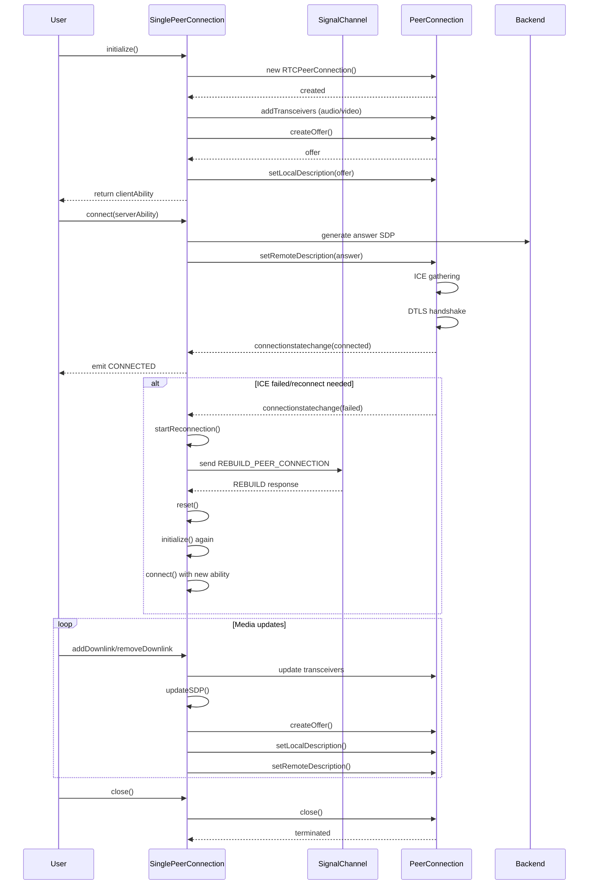

```mermaid
sequenceDiagram
    participant User
    participant SinglePeerConnection
    participant SignalChannel
    participant PeerConnection
    participant Backend

    User->>SinglePeerConnection: initialize()
    SinglePeerConnection->>PeerConnection: new RTCPeerConnection()
    PeerConnection-->>SinglePeerConnection: created
    SinglePeerConnection->>PeerConnection: addTransceivers (audio/video)
    SinglePeerConnection->>PeerConnection: createOffer()
    PeerConnection-->>SinglePeerConnection: offer
    SinglePeerConnection->>PeerConnection: setLocalDescription(offer)
    SinglePeerConnection-->>User: return clientAbility

    User->>SinglePeerConnection: connect(serverAbility)
    SinglePeerConnection->>Backend: generate answer SDP
    SinglePeerConnection->>PeerConnection: setRemoteDescription(answer)
    PeerConnection->>PeerConnection: ICE gathering
    PeerConnection->>PeerConnection: DTLS handshake
    PeerConnection-->>SinglePeerConnection: connectionstatechange(connected)
    SinglePeerConnection-->>User: emit CONNECTED

    alt ICE failed/reconnect needed
        PeerConnection-->>SinglePeerConnection: connectionstatechange(failed)
        SinglePeerConnection->>SinglePeerConnection: startReconnection()
        SinglePeerConnection->>SignalChannel: send REBUILD_PEER_CONNECTION
        SignalChannel-->>SinglePeerConnection: REBUILD response
        SinglePeerConnection->>SinglePeerConnection: reset()
        SinglePeerConnection->>SinglePeerConnection: initialize() again
        SinglePeerConnection->>SinglePeerConnection: connect() with new ability
    end

    loop Media updates
        User->>SinglePeerConnection: addDownlink/removeDownlink
        SinglePeerConnection->>PeerConnection: update transceivers
        SinglePeerConnection->>SinglePeerConnection: updateSDP()
        SinglePeerConnection->>PeerConnection: createOffer()
        SinglePeerConnection->>PeerConnection: setLocalDescription()
        SinglePeerConnection->>PeerConnection: setRemoteDescription()
    end

    User->>SinglePeerConnection: close()
    SinglePeerConnection->>PeerConnection: close()
    PeerConnection-->>SinglePeerConnection: terminated
```